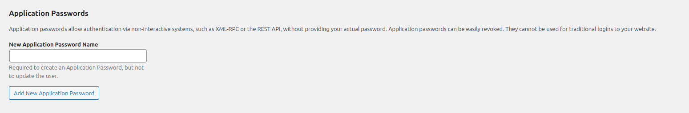

# PDF-Parser

A software to parse print-ready newspaper PDF's. \
After extracting articles of each page, each article is published via the Wordpress API.

## Installation guide

### LocalWP

**Install**\
First, for a local development setup you need to install [LocalWP](https://localwp.com/help-docs/getting-started/installing-local/).

**Create website**\
Second, you need to create a local wordpress website to be able to publish posts via the Parser.\
Here is a detailed [How-To-Video](https://www.youtube.com/watch?v=KXQFpUnCgrE) for more information on LocalWP.\
Important: Remember your username and URL since these credentials are needed for the parser to communicate.

**Generate Application Password**\
Third, in your Wordpress Backend navigate to Users > Profile. Scroll down to the “Application Passwords” heading.\
Add a new Application Password and copy your new password to a safe place like your Password Manager.\

Detailed instructions can be read [here](https://www.paidmembershipspro.com/create-application-password-wordpress/) and watched [here](https://www.youtube.com/watch?v=bsz6hb1EUMY)

### PDF-Parser

**Clone**\
Clone this repository on your local machine.

**Install required packages**\
We assume you have Python installed and use a virtual environment like [venv](https://www.freecodecamp.org/news/virtualenv-with-virtualenvwrapper-on-ubuntu-18-04/).\
In your virtual environment, run:
```python
pip install -r requirements.txt
```

**Create .env file**\
In the main directory copy `.env.example` into `.env`\
Then change all the credentials to your specific needs as such:
- AUGUSTIN_PLUGIN_URL: The URL of your Wordpress API like `http://localhost:10014/wp-json/wp/v2/`. This is the URL, you should have remembered during the local Wordpress site creation.
- WP_API_USER: Your Wordpress username, you were supposed to remember during the local Wordpress site creation and you log in with.
- WP_API_KEY: Your Application password you saved somewhere secret after generating it.

**Start the app**\
Next, run in your terminal:
```python
uvicorn main:app --reload
```

**Visit the app**\
In your browser visit `localhost:8000`

**Upload your PDF**\
In your browser upload your PDF file and check the results on your local Wordpress site.\


