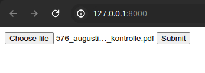

# PDF-Parser

A software to parse print-ready newspaper PDF's. \
After extracting articles of each page, each article is published via the Wordpress API.

## Installation guide

### LocalWP

**Install**\
First, for a local development setup you need to install [LocalWP](https://localwp.com/help-docs/getting-started/installing-local/).

**Create website**\
Second, you need to create a local wordpress website to be able to publish posts via the Parser.\
Here is a detailed [How-To-Video](https://www.youtube.com/watch?v=KXQFpUnCgrE) for more information on LocalWP.\
Important: Remember your username and URL since these credentials are needed for the parser to communicate.

**Generate Application Password**\
Third, in your Wordpress Backend navigate to Users > Profile. Scroll down to the “Application Passwords” heading.\
Add a new Application Password and copy your new password to a safe place like your Password Manager.\

Detailed instructions can be read [here](https://www.paidmembershipspro.com/create-application-password-wordpress/) and watched [here](https://www.youtube.com/watch?v=bsz6hb1EUMY)

**Create several categories**\
In your wordpress backend, click on the tab 'Posts' to the below submenu 'Categories'.\
Now create the following categories step by step without the quotation marks:\
"editorial","augustiner:in","einsicht","das wahre leben","cover","cover","cover","cover","tun & lassen","tun & lassen","tun & lassen","tun & lassen","vorstadt","vorstadt","lokalmatador:in nº","vorstadt","art.ist.in","art.ist.in","art.ist.in","art.ist.in","dichter innenteil","dichter innenteil","dichter innenteil","dichter innenteil","augustinchen","augustinchen"

### PDF-Parser

**Clone**\
Clone this repository on your local machine.

**Install required packages**\
We assume you have Python installed and use a virtual environment like [venv](https://www.freecodecamp.org/news/virtualenv-with-virtualenvwrapper-on-ubuntu-18-04/).\
In your virtual environment, run:

```python
pip install -r requirements.txt
```

**Create .env file**\
In the main directory copy `.env.example` into `.env`\
Then change all the credentials to your specific needs as such:

- WORDPRESS_URL: The URL of your Wordpress API like `http://localhost:10014/wp-json/wp/v2/`. This is the URL, you should have remembered during the local Wordpress site creation.
- WP_API_USER: Your Wordpress username, you were supposed to remember during the local Wordpress site creation and you log in with.
- WP_API_KEY: Your Application password you saved somewhere secret after generating it.

**Start the app**\
Next, run in your terminal:

```python
uvicorn main:app --reload
```

**Visit the app**\
In your browser visit `localhost:8000`

**Upload your PDF**\
In your browser upload your PDF file and check the results on your local Wordpress site.\


## Development

### VSCode extensions

For development we use VSCode. Further, to keep the code style consistent we use the following VSCode extensions:

- [Python](https://marketplace.visualstudio.com/items?itemName=ms-python.python)
- [Pylance](https://marketplace.visualstudio.com/items?itemName=ms-python.vscode-pylance)
- [Isort](https://marketplace.visualstudio.com/items?itemName=ms-python.isort)
- [Pylint](https://marketplace.visualstudio.com/items?itemName=ms-python.pylint)
- [Flake8](https://marketplace.visualstudio.com/items?itemName=ms-python.flake8)
- [Black Formatter](https://marketplace.visualstudio.com/items?itemName=ms-python.black-formatter)

Please install all of these extensions.\
In the next step please open your VSCode user settings i.e. your `settings.json` via `CTRL + SHIFT + P` and click on `Preferences: Open User Settings (JSON)`.\
In this file please add the following code below:

```json
  // Python specific settings
  "[python]": {
    "editor.formatOnType": true,
    // Set the python formatter to black
    "editor.defaultFormatter": "ms-python.black-formatter"
  },
  // Python linter settings
  "pylint.args": ["--max-line-length=120"],
  "flake8.args": ["--max-line-length=120"]
```

### Update requirements.txt

In case you add a new package for this project, first install [pipreqs](https://github.com/bndr/pipreqs) with:

```python
pip install pipreqs
```

Being in the project directory and to overwrite the current `requirement.txt` run

```bash
pipreqs ./ --force
```

**Important sidenote**\
Pipreqs uses the package fitz but for our CI to run adequate, we need to specify PyMuPDF.\
So please undo the change in this line afterwards.

Finally, check the rest of the file via git to make sure everything is fine and push it.

### Linting locally

To run everything as it happens in the Github Actions and fix it afterwards locally, do the following.

**Pylint**
To run pylint, use this command:

```bash
pylint $(git ls-files '*.py') --max-line-length=120
```

If pylint is not installed, run:
```bash
pip install pylint
```

**Flake8**
To run flake8, use this command:
```bash
flake8 . --count --select=E9,F63,F7,F82 --show-source --statistics
flake8 . --count --exit-zero --max-complexity=10 --max-line-length=127 --statistics
```

If flake8 is not installed, run:
```bash
pip install flake8
```

**Black**
To run black formatter, use this command:
```bash
black --check .
```

If black is not installed, run:
```bash
pip install black
```

### Testing locally

To run everything as it happens in the Github Actions and fix it afterwards locally, do the following.

**Pytest**
To run pytest, use this command:

```bash
pytest -v
```

If pytest is not installed, run:
```bash
pip install pytest
```
